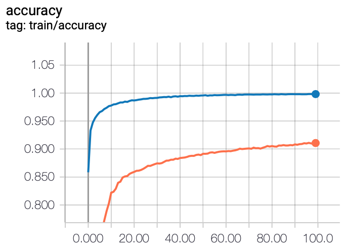
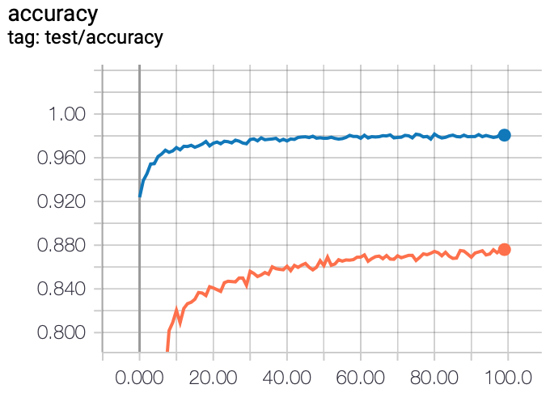

Implementation of Bayes by Backprop (http://proceedings.mlr.press/v37/blundell15) in PyTorch. Implements only the MNIST task with a single Gaussian prior. Includes the option to use Fashion MNIST.

Resources referenced:
* https://gluon.mxnet.io/chapter18_variational-methods-and-uncertainty/bayes-by-backprop.html

Train and test accuracy curves on MNIST (blue) and Fashion MNIST (orange):

